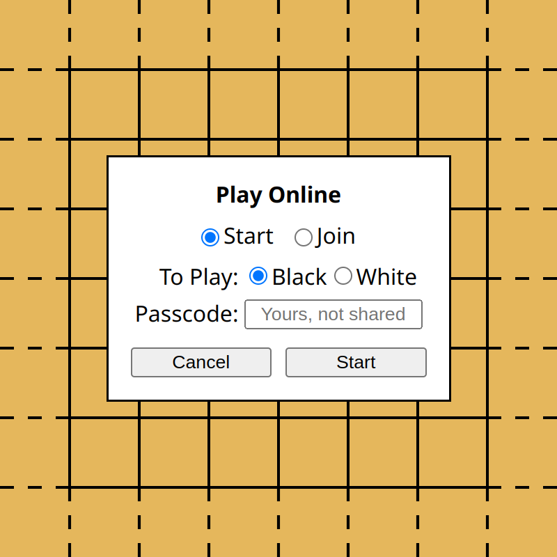

# c6ol: Connect6 Online

A web app for playing [Connect6] games online.

[Connect6]: https://en.wikipedia.org/wiki/Connect6

## Features

- **Easy Setup of Games:** Submit a passcode to start as Black. Then send a link to your opponent, who submits a different passcode to join as White.
- **Nearly Infinite Board:** The board is $2^{16}$ by $2^{16}$ in size, with drag & zoom support. In a game started near the center, you never worry about hitting the border.[^1]
- **Compact Record Format:** Based on zigzag encoding, a pairing function, and varints, the format encodes any stone placed within the central 11-by-11 area to a single byte.
- **Keyboard Control:** You can control the app with keyboard only.

[^1]: It is good sportsmanship to start near the center and to place stones near existing ones.

## Screenshots

<table>
  <tr>
    <td></td>
    <td></td>
  </tr>
  <tr>
    <td></td>
    <td></td>
  </tr>
</table>

## Setup

Install Rust 1.82+ and [Trunk](https://trunkrs.dev/). Then run:

```sh
git clone https://github.com/yescallop/c6ol
cd c6ol/client
trunk build
cd ../server
cargo run
```

The app will be served on port 8086.

## Play

You can choose to play offline or online.
An offline game is saved in the browser's local storage.
For now, an online game will end unsaved if no one is connected to it.
