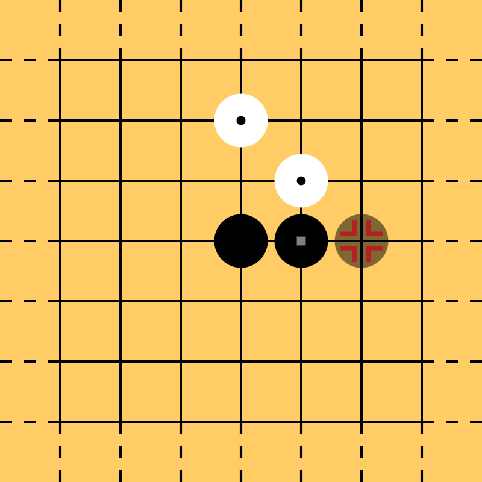

# c6ol: Connect6 Online

A web app for playing [Connect6] games online, built with Rust frameworks [Leptos] and [axum].

[Connect6]: https://en.wikipedia.org/wiki/Connect6
[Leptos]: https://github.com/leptos-rs/leptos
[axum]: https://github.com/tokio-rs/axum

## Play Now

An official instance is hosted at [c6.zhixia.dev](https://c6.zhixia.dev/). Please refrain from sending automatic requests without prior notice. Games idle for more than 30 days are subject to removal.

## Features

- **Easy Setup:** Submit a passcode to start a game. Then send a link to your friend, who submits a different passcode to join the game.
- **Infinite Board:** The board is $2^{16}$ by $2^{16}$ in size, with drag & zoom support. Generally[^1], you never worry about hitting the border.
- **Analysis (Permanent Link):** Click *Analyze* in the game menu to open a copy of the game in a new tab for analysis. Right click or long press to copy a permanent link. Feel free to share it with others or save it for your collection!
- **Requests:** Request your opponent to retract the previous move or reset the game (clear the stones and optionally swap colors), or offer a draw (why do this when you have infinite space and time?).
- **Manual Claim of Win:** Watch your friend not notice their six-in-a-row and win before them!
- **Offline Play:** You can choose to play offline. An offline game is saved in the browser's local storage.
- **Keyboard Control:** It's possible to control the app with keyboard only.

[^1]: It is good sportsmanship to start near the center and to place stones near existing ones.

## Screenshots

<table>
  <tr>
    <td></td>
    <td></td>
  </tr>
  <tr>
    <td></td>
    <td></td>
  </tr>
</table>

## Setup (Linux)

Install Rust 1.88+ and [Trunk](https://trunkrs.dev/). To develop, run:

```sh
git clone https://github.com/yescallop/c6ol
cd c6ol
# In one terminal:
cd server
cargo run
# In another:
cd client
trunk serve --open
```

To build for deployment, run:

```sh
cd client
trunk build --release
cd ../server
cargo build --release
cd ..
```

To deploy, copy `target/release/c6ol-server` and `client/dist` to a directory on the server, `cd` into it and run:

```sh
./c6ol-server --listen [::]:8086 --serve-dir dist --db-file c6ol.db
```

A Connect6 Online server will be listening at port 8086 on all available interfaces, serving static files under `dist`, loading games from and saving games to `c6ol.db`.
